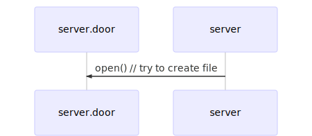

[Previous](.././00_begin/) | [Next](.././18_backgrounding_processes/)

# Preparing to hang the door
Because doors have a filesystem representation, we need to make sure they have a
nice, clean place to live on the filesytem. This means creating a new, empty
file and marking it with the appropriate permissions. To do that, we make use of
the [OPEN(2)](https://www.illumos.org/man/2/open) system call.

We want to create new file that we can write to, and that others can read from.
We also want to ensure that the file that we will use for our door does not
already exist. This is where the `O_CREAT|O_EXCL` flags come in handy: they tell
`open` that we want to create a new file, and we want to do so *exclusively*.
That is, we don't want some crufty old path that has already been used. If it
does, `open` will fail.

## Check for Understanding
1. Why call `open` with `0400` permissions insted of `0600` or `0444`?
1. Under what circumstances might `open` fail, given the flags we requested?
