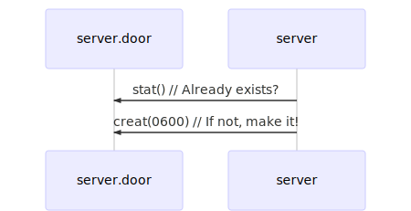

[Previous](.././00_begin/) | [Next](.././18_backgrounding_processes/)

# Preparing to hang the door
Because doors have a filesystem representation, we need to make sure they have a
nice, clean place to live on the filesytem. This means creating a new, empty
file and marking it with the appropriate permissions. To do that, we make use of
the following system calls:

* [STAT(2)](https://www.illumos.org/man/2/stat) checks if a path exists
* [CREAT(2)](https://www.illumos.org/man/2/creat) make new file, set permissions

Run `make test` to see this lesson in action. Notice how we can run `./server`
once to create the file, and then run it again without producing an error.

