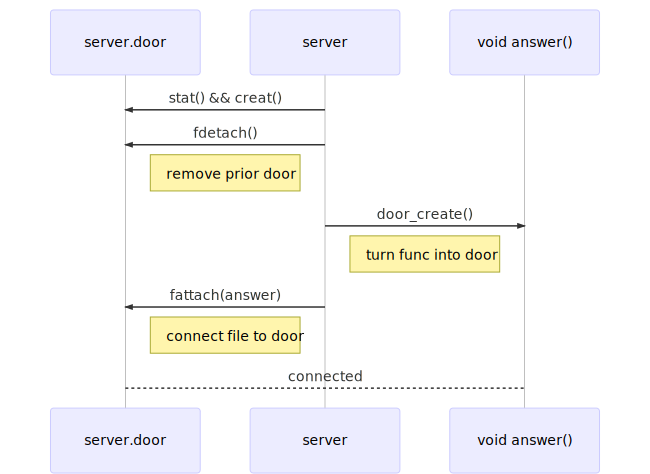

[Previous](.././18_backgrounding_processes/) | [Next](.././40_knock_knock/)

# Create a door
*Create a door and show what it looks like on the filesystem*

Next, we create the actual "door": This is a file descriptor that is associated
with a pointer to the `answer` function. We do this using the `DOOR_CREATE(3C)`
call referenced below.

If that succeeds, we can attach this file descriptor to the filesystem using the
`fattach` call. 



Run `make test` to build and launch this version of the door server in the
background. Now run `ls -AhlF server.door` and take a close look at the output.
You should see something like the following:

```
$ ls -AhlF server.door
Dr--r--r-- 1 root root 0 Mar 25 11:02 server.door>
```

The `D` in the permissions field and the `>` at the end of the filename tell us
that we are dealing with a door: a filesystem path that when `open`ed grants
access to a function within a running process. 

Now we will learn how to open doors and call door functions.

### New System Calls
* [DOOR_CREATE(3C)](https://illumos.org/man/3c/door_create)
* [FATTACH(3C)](https://illumos.org/man/3C/fattach)

## Check for Understanding
1. What changes about `server.door`'s attributes when `fattach` is called?
1. How can we leverage the fact that a door has normal UNIX access permissions?
