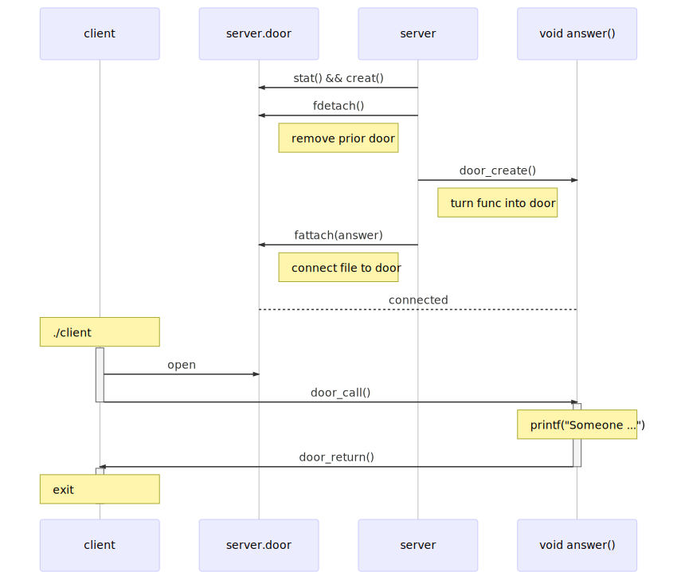

[Previous](.././20_create_a_door/) | [Next](.././80_hello_world/)

# Knock Knock
*Open a door and call a function in another process*

In this lesson, we introduce a client program defined in [client.c](client.c).
Its job is to open `server.door` and call the `answer` function inside a running
`server` process.



Opening a door is not (on the whole) different from opening other filesystem
resources in UNIX. Perhaps you are more accustomed to using `fopen` to deal with
files, but that is really a convenience layer which delegates some work to the
`open` call. 

Once the door has been opened, we have a valid "descriptor" for it: this is a
resource that the operating system attaches to the running `client` process and
manages on our behalf -- we use this descriptor to indicate to the operating
system which filesystem resource we would like to act upon. 

To call a function in another process via a door, we take an approach that is
not dissimilar from calling a local function: we need a reference to the
function and a collection of arguments to pass it. In this case, the reference
to the function is the file descriptor for the door, and the arguments need to
packed into a single char array. And since the language itself doesn't support
"calling" the descriptor like we would a normal function, we need to rely on the
doors api:

```c
door_call(door, argv, argc, NULL, 0);
```

We will get to the NULL argument soon. It's super cool, but we can't do anything
with it yet.

### New System Calls
* [DOOR_CALL(3C)](https://illumos.org/man/3C/door_call)

## Check for Understanding
1. What permissions do we need for the `open` call to succeed?
1. Which process's stdout prints the message when `answer` is called?
1. What is going on in the server process before `door_call`?
1. What is going on in the client process during `door_call`? 
