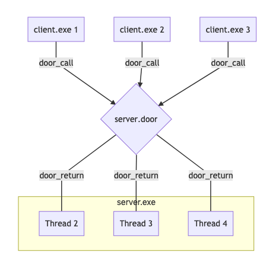

[Previous](.././80_hello_world/) | [Next](.././98_reuse_main_thread/)

# Automatic Thread Management
*Let your server respond to multiple requests at once!*

One of the things that makes the doors api so **enjoyable** to work with is that
it can automtically create a new thread as needed to handle incoming requests,
and will automatically map requests to available threads whenever possible.
Sometimes we want more control over thread creation (see [door_server_create][1]
or [door_bind][2]), but in many cases the default behavior does just what we
need!

In this lesson, [server.c](server.c) has been modified to respond with *"Hello
from server thread N!"* where *N* is the id of the illumos thread that is
handling our request. We have also modified the [Makefile](Makefile) so that it
will invoke three copies of the client binary.

If you build and run this lesson, you will see that three different threads
respond, each with a different id.

## Check for Understanding
1. The thread ids may or may not print in sequential order. Despite that, do you ever see anything from thread #1? Why or why not?
1. The `sleep(1)` statement in [server.c](server.c) was added for dramatic effect. What happens if you remove it?

[1]: https://illumos.org/man/3C/door_server_create
[2]: https://illumos.org/man/3C/door_bind
