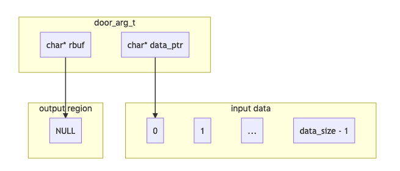
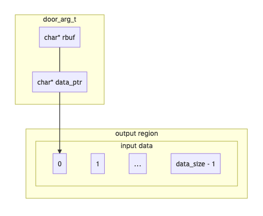

[Previous](.././80_hello_world/) | [Next](.././C0_file_through_door/)

# Return Sizes

Let's take another look at the structure we provided to `door_call`:

```c
// from DOOR_CALL(3C) in the illumos manual
typedef struct {
        char            *data_ptr;      /* Argument/result data */
        size_t          data_size;      /* Argument/result data size */
        door_desc_t     *desc_ptr;      /* Argument/result descriptors */
        uint_t          desc_num;       /* Argument/result num descriptors */
        char            *rbuf;          /* Result area */
        size_t          rsize;          /* Result size */
} door_arg_t;
```

What's with all the "Argument/result" stuff? That tells us that the doors
api expects to be able to overwrite some of the data we give it: that is, `args`
is both an *in* and an *out* parameter.

### Args as an "in parameter"


What we see here is that the `door_arg_t` struct lets us tell the doors api both
what data we want to send (`data_ptr`) and where we want the response to be
written (`rbuf`). For this tutorial, we will always set `rbuf` to NULL: this
tells the doors api that we want it to deal with allocating the response memory,
and the client will be responsible for freeing it later.

We could decide to allocate some memory ahead of time to be used for the
results. In that case, we would set `rbuf` to the location we'd like to store
the response in, and `rsize` to the number of bytes which have been set aside
for this purpose. This can be a useful performance optimization, but we can be
satisfied with the default behavior for the moment.

### Args as an "out parameter"


```c
int result = door_call(door, &args);
```

In this case, `result` only tells us whether `door_call` completed without being
interrupted. Because we passed a pointer to `args`, any of its components could
have been modified during the call, so we need to inspect them to really
understand our results.

Recall the output from the previous lesson: When the server responded "Well,
hello yourself" there was some trailing garbage. That's because we allocated 32
characters for a response, but it returned fewer than that.

This is all a bit confusing (or that's how I felt about it, anyhow): `rsize` is
the total *capacity* of `rbuf`, but the number of meaningful characters returned
by the server process will be written to the `data_size` member. So even though
we had 32 bytes allocated, only 23 of them were used, so only 23 of them should
be printed. To get a better look at that, observe the `printf` statements near
the bottom of [client.c](client.c):
