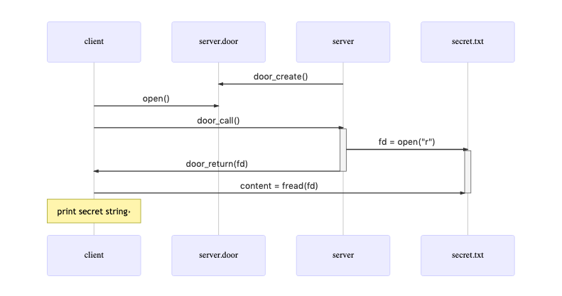

[Previous](.././A0_result_parameters/) | [Next](.././E0_door_through_door/)

# Pass a file through a door
In this lesson, we show how to use the `door_return` call to pass an open file
descriptor to another process. This technique can allow a door server (running
as user A) to give read access to a door client (running as user B) even if the
filesystem permissions would not normally allow user B to read the file.

This ability to pass open file descriptors to other processes is a standard (and
clever!) feature of UNIX IPC. In itself, passing a file descriptor is not that
interesting; we could just as easily read the file contents in the server
procedure and pass that data to the client. Passing descriptors for other types
of resources affords us some very interesting design patterns, as we will see in
future lessons.

## Check for Understanding
1. In the code provided, the path to `secret_data` is hardcoded in the server. Modify [server.c](server.c) and [client.c](client.c) such that the client tells the server which path it would like to open. You may want to refer to previous lessons.
