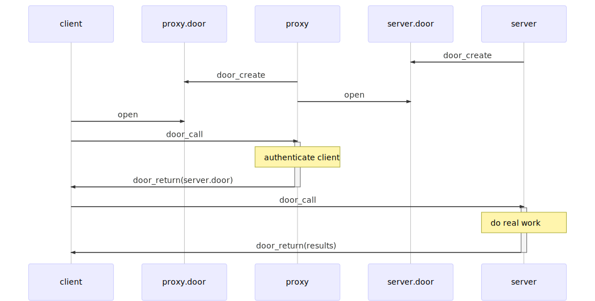

[Previous](.././C0_file_through_door/) | [Next](.././F0_speed_test/)

# Pass a door through a door
In this lesson, we show how to use the `door_return` call to pass an open door
descriptor to another process. Descriptor passing is an important feature of
UNIX IPC in general, but the doors api does so in a way that is reminiscent of
passing a lambda function.

Consider three processes: **client**, **proxy**, and **server**. Process
**server** creates a door which can be opened by **proxy**, then process
**proxy** creates a door which can be opened by **client**. When **client**
performs `door_call` on **proxy**'s door, **proxy** can `door_return` its
descriptor to **server**. When **client**'s `door_call` completes, **client**
will have a new open door descriptor pointing to the door that **server** opened
for **proxy**. This allows **client** and **server** to communicate without
explicit knowledge of one another's identities.

*But why not let client and server communicate directly?*

In this situation, process **proxy** has the opportunity to decide whether
**client** and **server** should communicate. For example, **proxy** may require
some form of credentials from **client** before allowing access to **server**.
This allows **server** to focus on doing what it does best, leaving it up to
**proxy** to focus on the authentication question.

As another example, **proxy** could act as a sortof router: inspecting the
requests coming from **client** before handing **client** a door descriptor
either to **server** or some other door server process as appropriate.

This is weird, and it's worth thinking about slowly.

## Check for Understanding
1. Will this example still work if `server.door` is not readable by the client?
1. Will this example still work if `proxy.door` is not readable by the client?
1. Will this example still work if `server.door` is not readable by the proxy?
