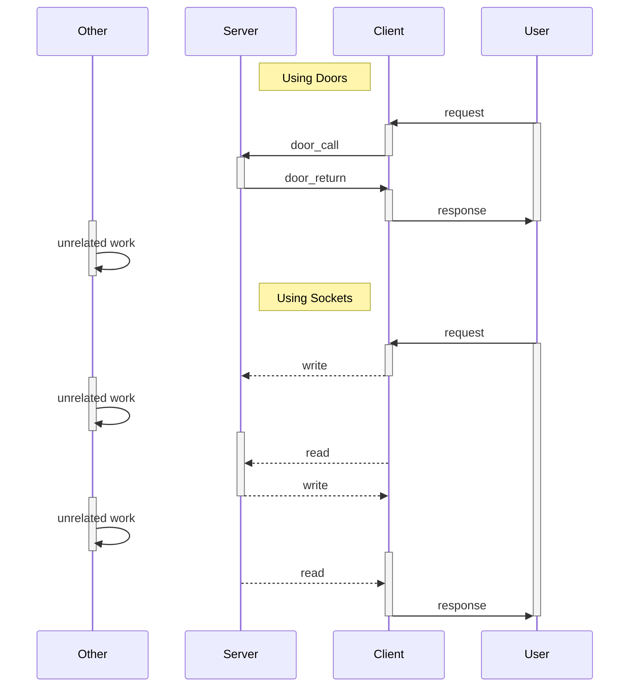

[Previous](.././E0_door_through_door/) | [Next](.././FF_finish/)

# Doors vs Sockets: Which are faster?
Doors get their speed by passing control from the client to the server
without giving up the current CPU timeslice. This means they can be
faster than sockets in certain situations. It all has to do with the
cost of switching back from the client to the server and back.

