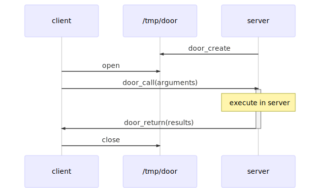

Get Started: [Before we Begin](00_begin/ "Before we Begin")

# Revolving Doors
*Learning the illumos Doors API*

illumos Doors are a novel form of inter-process communication. They allow a
thread in a client process to call a function in a server process, automatically
spawning a handler thread in the server process if needed.

This repository includes a set of annotated code examples of increasing
complexity, each of which discusses a different aspect of the doors API. Though
unusual, this API is not very big. The goal of this project is to help folks
become comfortable with the doors API in two or three attempts.

### Prerequisites
You should know a little C, and have an interest in systems programming. More
specifically, this tutorial assumes you either understand or can teach yourself
about the following:

* When a process opens a file, it gets back a "file descriptor" which is an int
* Making a "System Call" is really just asking the OS to do something for you
* C represents arrays by a pointer to the beginning of some data, and its length
* `printf` takes some funky arguments, and you have to look those up sometimes.

##### illumos
Of course, to play with doors, you will need access to illumos! I recommend
these two routes, depending on your preferences:

* Want to run it in a VM on your desktop? Try [OpenIndiana](appendices/OpenIndiana).
* Just want to spin up a cloud instance? I like SmartOS on [Joyent](appendices/SmartOS).

Doors are super lightweight, so feel free to be as cheap as you want. You will
not need significant resources for this tutorial.

### Sources
I am writing this because there seems to be so little about doors on the 
internet. Here is what I have been able to gather, in order of usefulness:

* Chapter 15 "Doors" of *UNIX Network Programming, Volume 2, Second Edition: Interprocess Communications*, Prentice Hall, 1999, ISBN 0-13-081081-9.
* [DOOR_CREATE(3C)](https://illumos.org/man/3C/door_create)
* ["Doors" in SolarisTM: Lightweight RPC using File Descriptors](http://www.kohala.com/start/papers.others/doors.html)
* [Door API Details](https://blogs.oracle.com/tucker/door-api-details)
* [illumos-fuse2](https://bitbucket.org/gwr/illumos-fuse2)
* [Linux Doors](http://ldoor.sourceforge.net) 

### Special Thanks
* [@jack-morrison](https://github.com/jack-morrison) and [@AnthonyDiGirolamo](https://github.com/AnthonyDiGirolamo) for encouraging me to get the OpenIndiana setup guide together
* Nicole Deasy for suggesting explicit forward/backward navigation over github's built-in nav
* [@jasonbking](https://github.com/jasonbking) for [this excellent feedback](https://www.reddit.com/r/illumos/comments/babxsl/doors_api_tutorial/eke7es9/)
* The excellent [Mermaid](https://mermaidjs.github.io/) library which was used to create the diagrams in each lesson
* [Social Media icon](https://commons.wikimedia.org/wiki/File:Revolving_Door_Sign.jpg) due to [Daniel Lobo](https://www.flickr.com/photos/daquellamanera/), licensed [(CC BY-SA 2.0)](https://creativecommons.org/licenses/by-sa/2.0/deed.en). Retrieved at the time of this commit.
