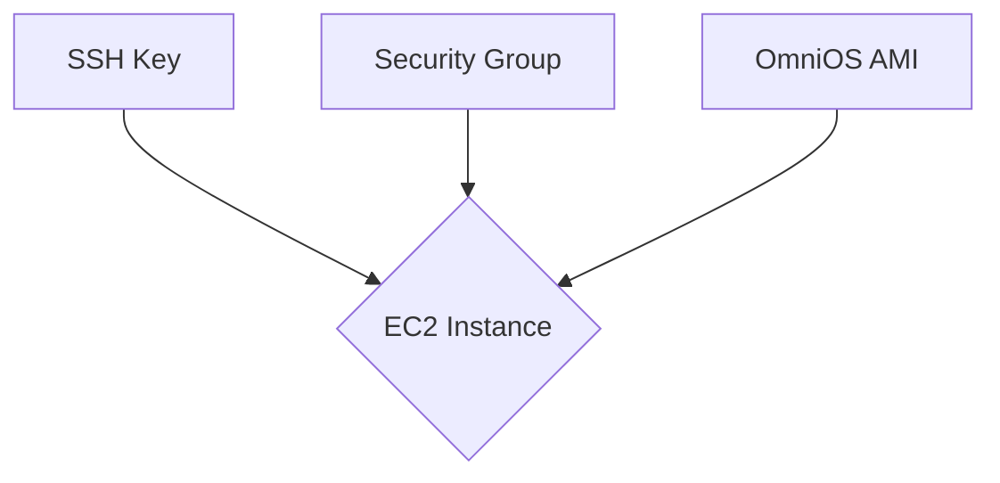

# Bootstrapping OmniOS on AWS
If you are already an AWS customer, this may be the easiest way to stand
up an illumos development environment.

If you already have Terraform installed, you can simply run `make login`
in this directory -- an EC2 instance running OmniOS will be stood up in
your account, and a dedicated SSH key will be created in the `build/`
directory. Using a dedicated SSH key makes the bootstrapping process a
little less complex for me, but serves no other purpose. Feel free to
circumvent this if you prefer.

We assume you are closest to the `us-east-1` region, but if that is not
the case, simply update the `region` field in
[`providers.tf`](providers.tf).

If you are new to Terraform, you can download it
[here](https://www.terraform.io/downloads). Also, note that you will be
prompted to agree to the infrastructure changes that I am proposing to
make in your account. They are:

* A small EC2 Instance running OmniOS
* A dedicated security group for this instance, allowing SSH ingress
  from everywhere
* A dedicated public key (corresponding to the dedicated key that will
  be created in `ssh/lab_key`)

The changes are defined in [`lab_host.tf`](lab_host.tf), which will give
you all the specifics.

## Poking around
Once the bootstrapping process has finished (it may take a minute)
you'll be logged in to your new OmniOS instance, and a copy of the
`revolving-doors` repo will be in your home directory.  Head on over to
[Before we Begin](00_begin/ "Before we Begin") to start the tutorial!

## Cleaning up
When you are done learning about Doors, you can destroy the resources
I created in your account by running `make clean`. If anything goes
wrong, all of the resources should be tagged "Name = revolving-door" so
that you can identify them, and recognize them as separate from other
resources in your AWS account.
