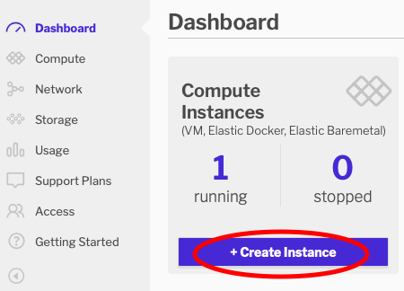
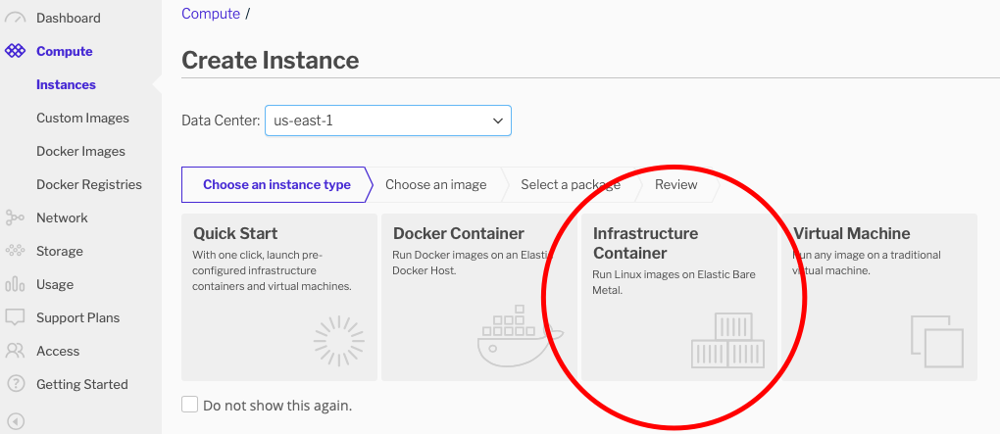
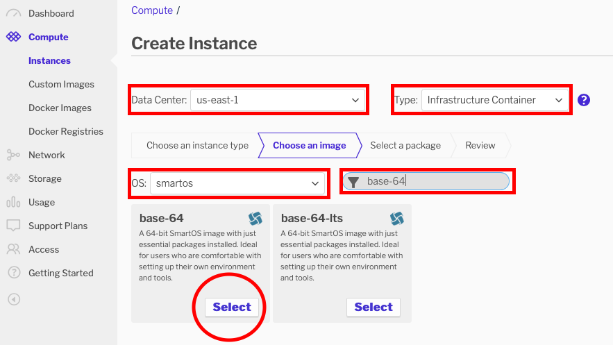
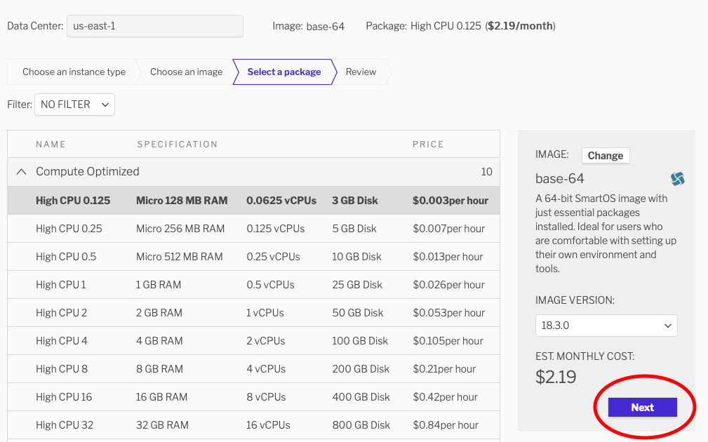
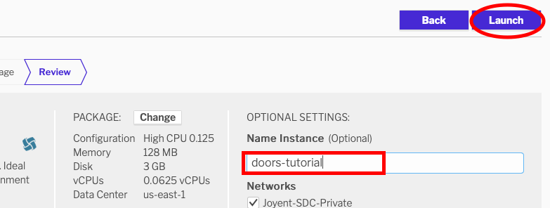
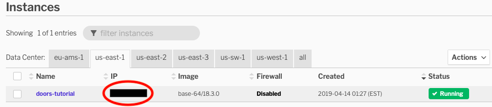

# Setup SmartOS on Joyent
*From zero to illumos in eight minutes*

This can be somewhat less overhead that setting up a VM on VirtualBox, and may
be more your style if you prefer things like the AWS Console.

### Sign up for a Joyent account
Follow [this link](https://lpage.joyent.com/Triton-Free-Trial.html) to set up a
Triton account (Triton is the name of Joyent's SmartOS-based cloud) that comes
with more than enough free cycles to work through this tutorial. If you already
have an account and are out of the free-cycle realm, rest assured you can
complete this tutorial for a matter of pennies.

Setting up your account will require you to share an SSH public key with Joyent.
You will need to use the corresponding private key to access your SmartOS
instance.

### Create a new "Infrastructure Container"
This is Triton-lingo for "create a new SmartOS zone". This will give you a self-
contained virtual copy of illumos that you can use for this tutorial.



#### Select the instance type
Triton lets you do a number of things, but for our purposes we want an
"Infrastructure Container" in `us-east-1` (unless you happen to know another
location is closer to you).



#### Select the OS
We want SmartOS -- specifically the "base" image that doesn't have a lot
configured already. We'll add exactly what we want later.



#### Select the instance size
Doors are super lightweight, so we need almost nothing for this tutorial. Choose
the cheapest instance size offered.



#### Launch
Name this sucker 'doors-tutorial' and launch it!



### Connect to your new Instance
Keep an eye on your list of instances in your Triton control panel. When you see
your previously configured instance boot, note its ip address:



`ssh` into that host as root, using the keypair you specified earlier.

### Install the dependencies we need for this tutorial
```bash
pkgin install git-2.19.1
pkgin install gmake-4.2.1nb1
pkgin install gcc8-8.2.0
echo 'PATH=$PATH:/opt/local/gcc8/bin' >> ~/.profile
source ~/.profile
git clone https://github.com/robertdfrench/revolving-door.git
cd revolving-door
gmake test # Make sure the whole tutorial builds on your system!
```

Once you are done, remember to tear this instance down, or Joyent will continue
to bill you for it.
